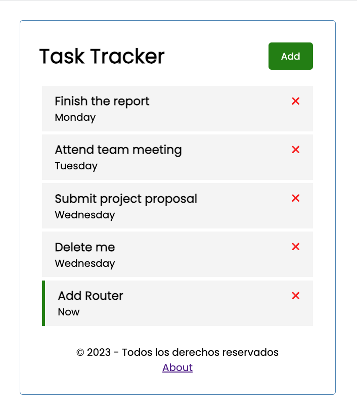

## Application Screenshot


## start dev server
```bash
ng serve
```

## generate componenet
```bash
ng generate componenet <directory>/<name>
```

## generate service
```bash
ng generate service <directory>/<name>
```

## json-server
```bash
docker compose up -d
```


## emit event
```typescript
input { ..., Output, EventEmitter } from '@angular/core';

export class TaskItemComponent {
  @Output() onDeleteTask: EventEmitter<Task> = new EventEmitter();

  deleteTask(task: Task) {
    this.onDeleteTask.emit(task);
  }
}
```


